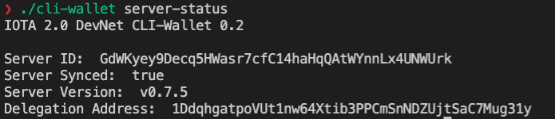
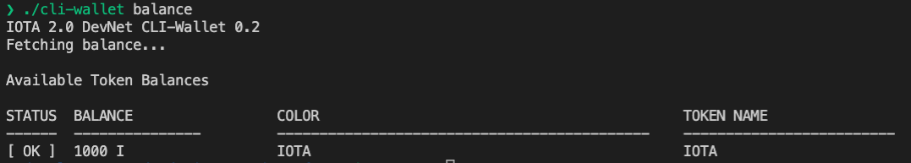
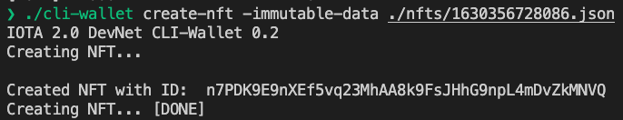
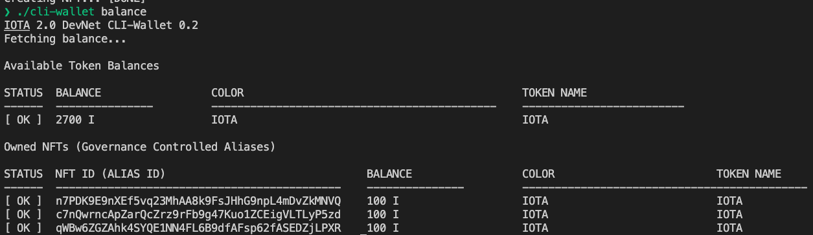

# IOTA Native NFTs with IPFS Metadata extension

This application mints IOTA Native NFTs which can transfered without any fees. It uses the first version of a [fully decentralized IOTA network](https://v2.iota.org/). The native metadata links to an [IPFS](https://ipfs.io/) file, which also can include images or big data files. The application uses [nft.storage](https://nft.storage/) is a brand new service, built specifically for storing off-chain NFT data which is easy to implement. 

## Run server
```bash
npm install
npm start
```

## Run the CLI Wallet Manually

Check IOTA v2 Devnet node status


Check the balance


Create a NFT (the application does this, but you also can do it manually)


Check the balance with some NFTs


